# ICCT Smart Attendance System - Entity Relationship Diagram (ERD)

## Overview
This ERD represents the database structure for the ICCT Smart Attendance System, showing all entities, their attributes, and relationships.

## Entity Relationship Diagram

```mermaid
erDiagram
    %% Core User Management
    User {
        int userId PK
        string userName
        string email UK
        string passwordHash
        enum role
        enum status
        datetime lastLogin
        datetime createdAt
        datetime updatedAt
    }

    UserPreferences {
        int id PK
        int userId FK
        boolean notifications
        string language
        string theme
        datetime createdAt
    }

    RoleManagement {
        int id PK
        string name UK
        string description
        string[] permissions
        enum status
        datetime createdAt
    }

    %% Student Management
    Student {
        int studentId PK
        string studentIdNum UK
        string rfidTag UK
        string firstName
        string lastName
        string email UK
        string phoneNumber UK
        enum gender
        enum studentType
        enum status
        enum yearLevel
        int courseId FK
        int departmentId FK
        int userId FK
        datetime createdAt
    }

    Guardian {
        int guardianId PK
        string email UK
        string phoneNumber UK
        string firstName
        string lastName
        enum gender
        enum guardianType
        enum status
        datetime createdAt
    }

    %% Academic Structure
    Department {
        int departmentId PK
        string departmentName
        string departmentCode UK
        enum departmentType
        enum status
        int headOfDepartment FK
        datetime createdAt
    }

    CourseOffering {
        int courseId PK
        string courseCode UK
        string courseName
        enum courseType
        enum courseStatus
        int departmentId FK
        int totalUnits
        datetime createdAt
    }

    Section {
        int sectionId PK
        string sectionName UK
        int sectionCapacity
        enum sectionStatus
        int yearLevel
        string academicYear
        enum semester
        int courseId FK
        int semesterId FK
        datetime createdAt
    }

    Semester {
        int semesterId PK
        datetime startDate
        datetime endDate
        int year
        enum semesterType
        enum status
        boolean isActive
        datetime createdAt
    }

    StudentSection {
        int studentSectionId PK
        int studentId FK
        int sectionId FK
        enum enrollmentStatus
        datetime enrollmentDate
        datetime createdAt
    }

    %% Subject Management
    Subjects {
        int subjectId PK
        string subjectName
        string subjectCode UK
        enum subjectType
        enum status
        int lectureUnits
        int labUnits
        int courseId FK
        int departmentId FK
        string academicYear
        enum semester
        datetime createdAt
    }

    Instructor {
        int instructorId PK
        string email UK
        string phoneNumber UK
        string firstName
        string lastName
        enum gender
        enum instructorType
        enum status
        int departmentId FK
        string rfidTag UK
        string employeeId UK
        datetime createdAt
    }

    SubjectSchedule {
        int subjectSchedId PK
        int subjectId FK
        int sectionId FK
        int instructorId FK
        int roomId FK
        enum day
        string startTime
        string endTime
        enum scheduleType
        enum status
        int semesterId FK
        string academicYear
        datetime createdAt
    }

    StudentSchedule {
        int id PK
        int studentId FK
        int scheduleId FK
        enum status
        datetime enrolledAt
    }

    %% Room Management
    Room {
        int roomId PK
        string roomNo UK
        enum roomType
        int roomCapacity
        string readerId UK
        enum status
        boolean isActive
        enum roomBuildingLoc
        enum roomFloorLoc
        datetime createdAt
    }

    RFIDReader {
        int readerId PK
        int roomId FK
        string deviceId UK
        string deviceName
        json components
        enum status
        datetime lastSeen
        datetime createdAt
    }

    %% RFID System
    RFIDTags {
        int tagId PK
        string tagNumber UK
        enum tagType
        enum status
        int studentId FK
        int assignedBy FK
        datetime assignedAt
        datetime expiresAt
    }

    RFIDLogs {
        int logsId PK
        string rfidTag
        int readerId FK
        enum scanType
        enum scanStatus
        string location
        datetime timestamp
        int userId FK
        int attendanceId FK
    }

    %% Attendance System
    Attendance {
        int attendanceId PK
        int eventId FK
        int userId FK
        enum userRole
        enum status
        enum attendanceType
        enum verification
        datetime timestamp
        datetime checkOutTime
        int duration
        string notes
        int verifiedBy FK
        int semesterId FK
        int studentId FK
        int subjectSchedId FK
        int rfidLogId FK
    }

    Event {
        int eventId PK
        int createdBy FK
        string title
        string description
        enum eventType
        datetime eventDate
        datetime endDate
        string location
        int capacity
        boolean isPublic
        enum status
        datetime createdAt
    }

    %% Notifications
    AttendanceNotification {
        int notificationId PK
        int studentId FK
        int attendanceId FK
        enum type
        string message
        enum recipient
        enum method
        enum status
        datetime sentAt
    }

    Notification {
        int id PK
        int userId FK
        string title
        string message
        string type
        string priority
        boolean isRead
        datetime createdAt
    }

    Announcement {
        int announcementId PK
        int createdby FK
        enum userType
        string title
        string content
        boolean isGeneral
        int subjectId FK
        int sectionId FK
        int instructorId FK
        enum status
        datetime createdAt
    }

    %% Security & Logging
    SecurityAlert {
        string id PK
        string type
        string title
        string message
        datetime timestamp
        int userId FK
        string ipAddress
        boolean resolved
        int resolvedBy FK
        datetime resolvedAt
    }

    SystemLog {
        string id PK
        datetime timestamp
        string level
        string module
        string action
        int userId FK
        string userEmail
        string ipAddress
        string details
        boolean resolved
    }

    SecurityLog {
        string id PK
        datetime timestamp
        string level
        string module
        string action
        int userId FK
        string userEmail
        string ipAddress
        string details
        boolean resolved
    }

    RfidLog {
        string id PK
        datetime timestamp
        string level
        string module
        string action
        int userId FK
        string userEmail
        string ipAddress
        string details
        boolean resolved
    }

    %% Backup System
    SystemBackup {
        int id PK
        string name
        string description
        enum type
        string size
        enum status
        enum location
        boolean isEncrypted
        int retentionDays
        int createdBy FK
        datetime createdAt
        datetime completedAt
    }

    BackupSchedule {
        int id PK
        string name
        string description
        enum frequency
        int interval
        string timeOfDay
        boolean isActive
        datetime lastRun
        datetime nextRun
        enum backupType
        enum location
        int createdBy FK
        datetime createdAt
    }

    BackupLog {
        int id PK
        int backupId FK
        string action
        string status
        string message
        int createdBy FK
        datetime createdAt
    }

    %% Email System
    Email {
        string id PK
        string subject
        string sender
        string recipient
        datetime timestamp
        enum status
        enum priority
        enum type
        string content
        boolean isRead
        boolean isStarred
        boolean isImportant
        datetime createdAt
    }

    EmailRecipient {
        int id PK
        string emailId FK
        string address
        enum rtype
        datetime createdAt
    }

    EmailAttachment {
        int id PK
        string emailId FK
        string name
        string url
        datetime createdAt
    }

    %% Reports
    ReportLog {
        int reportId PK
        int generatedBy FK
        enum reportType
        string reportName
        string description
        datetime startDate
        datetime endDate
        enum status
        string filepath
        datetime createdAt
    }

    %% Relationships
    User ||--o{ UserPreferences : "has"
    User ||--o{ Student : "creates"
    User ||--o{ Instructor : "creates"
    User ||--o{ Attendance : "records"
    User ||--o{ SystemLog : "generates"
    User ||--o{ SecurityLog : "generates"
    User ||--o{ RfidLog : "generates"
    User ||--o{ Notification : "receives"
    User ||--o{ SystemBackup : "creates"
    User ||--o{ ReportLog : "generates"
    User ||--o{ SecurityAlert : "triggers"
    User ||--o{ Event : "creates"
    User ||--o{ Announcement : "creates"
    User ||--o{ RFIDTags : "assigns"
    User ||--o{ BackupSchedule : "creates"
    User ||--o{ BackupLog : "creates"
    User ||--o{ PasswordResetToken : "has"
    User ||--o{ RestorePoint : "creates"
    User ||--o{ BackupSystemLog : "generates"
    User ||--o{ SystemLogs : "generates"
    User ||--o{ Backup : "creates"
    User ||--o{ RoleManagement : "belongs to"

    Student ||--o{ Guardian : "has"
    Student ||--o{ Attendance : "records"
    Student ||--o{ RFIDTags : "assigned"
    Student ||--o{ StudentSection : "enrolled in"
    Student ||--o{ StudentSchedule : "enrolled in"
    Student ||--o{ AttendanceNotification : "receives"
    Student ||--o{ CourseOffering : "enrolled in"
    Student ||--o{ Department : "belongs to"

    Guardian ||--o{ Student : "monitors"

    Department ||--o{ CourseOffering : "offers"
    Department ||--o{ Student : "manages"
    Department ||--o{ Instructor : "employs"
    Department ||--o{ Subjects : "offers"
    Department ||--o{ User : "headed by"

    CourseOffering ||--o{ Section : "has"
    CourseOffering ||--o{ Student : "enrolls"
    CourseOffering ||--o{ Subjects : "includes"

    Section ||--o{ StudentSection : "enrolls"
    Section ||--o{ SubjectSchedule : "scheduled"
    Section ||--o{ Announcement : "receives"

    Semester ||--o{ Section : "contains"
    Semester ||--o{ SubjectSchedule : "scheduled in"
    Semester ||--o{ Attendance : "records"

    Subjects ||--o{ SubjectSchedule : "scheduled"
    Subjects ||--o{ Announcement : "announced for"
    Subjects ||--o{ CourseOffering : "belongs to"
    Subjects ||--o{ Department : "offered by"
    Subjects ||--o{ Instructor : "taught by"

    Instructor ||--o{ SubjectSchedule : "teaches"
    Instructor ||--o{ Subjects : "teaches"
    Instructor ||--o{ Announcement : "creates"
    Instructor ||--o{ Department : "belongs to"

    SubjectSchedule ||--o{ StudentSchedule : "enrolled by"
    SubjectSchedule ||--o{ Attendance : "records"
    SubjectSchedule ||--o{ Room : "held in"
    SubjectSchedule ||--o{ Semester : "scheduled in"
    SubjectSchedule ||--o{ Section : "for"
    SubjectSchedule ||--o{ Subjects : "of"

    Room ||--o{ SubjectSchedule : "hosts"
    Room ||--o{ RFIDReader : "equipped with"

    RFIDReader ||--o{ RFIDLogs : "generates"
    RFIDReader ||--o{ RFIDReaderLogs : "logs"

    RFIDTags ||--o{ RFIDLogs : "scanned"
    RFIDTags ||--o{ Student : "assigned to"
    RFIDTags ||--o{ RFIDTagAssignmentLog : "tracks"

    RFIDLogs ||--o{ Attendance : "creates"

    Attendance ||--o{ AttendanceNotification : "triggers"
    Attendance ||--o{ Event : "for"
    Attendance ||--o{ Student : "by"
    Attendance ||--o{ SubjectSchedule : "for"
    Attendance ||--o{ Semester : "in"
    Attendance ||--o{ RFIDLogs : "from"

    Event ||--o{ Attendance : "tracks"

    Email ||--o{ EmailRecipient : "sent to"
    Email ||--o{ EmailAttachment : "has"

    SystemBackup ||--o{ BackupLog : "logs"
    SystemBackup ||--o{ BackupScheduleLog : "scheduled"
    SystemBackup ||--o{ RestorePoint : "creates"

    BackupSchedule ||--o{ BackupScheduleLog : "executes"

    StudentSection ||--o{ Section : "belongs to"
    StudentSection ||--o{ Student : "enrolled by"

    StudentSchedule ||--o{ Student : "enrolled by"
    StudentSchedule ||--o{ SubjectSchedule : "scheduled in"

    AttendanceNotification ||--o{ Student : "sent to"
    AttendanceNotification ||--o{ Attendance : "about"

    SecurityAlert ||--o{ User : "affects"
    SecurityAlert ||--o{ User : "resolved by"

    SystemLog ||--o{ User : "generated by"
    SecurityLog ||--o{ User : "generated by"
    RfidLog ||--o{ User : "generated by"
    BackupSystemLog ||--o{ User : "generated by"

    ReportLog ||--o{ User : "generated by"

    Announcement ||--o{ User : "created by"
    Announcement ||--o{ Instructor : "created by"
    Announcement ||--o{ Section : "targeted to"
    Announcement ||--o{ Subjects : "about"

    PasswordResetToken ||--o{ User : "belongs to"

    RestorePoint ||--o{ SystemBackup : "from"
    RestorePoint ||--o{ User : "created by"

    BackupLog ||--o{ SystemBackup : "for"
    BackupLog ||--o{ User : "created by"

    BackupScheduleLog ||--o{ BackupSchedule : "executes"
    BackupScheduleLog ||--o{ SystemBackup : "creates"
    BackupScheduleLog ||--o{ User : "created by"

    RFIDTagAssignmentLog ||--o{ RFIDTags : "tracks"

    RFIDReaderLogs ||--o{ RFIDReader : "from"

    SystemLogs ||--o{ User : "generated by"

    Backup ||--o{ User : "created by"

    Notification ||--o{ User : "sent to"
```

## Key Entity Groups

### 1. **User Management**
- `User` - Core user accounts with authentication
- `UserPreferences` - User-specific settings
- `RoleManagement` - Custom role definitions
- `PasswordResetToken` - Password recovery

### 2. **Academic Structure**
- `Department` - Academic departments
- `CourseOffering` - Available courses
- `Section` - Class sections
- `Semester` - Academic terms
- `Subjects` - Course subjects
- `Instructor` - Teaching staff

### 3. **Student Management**
- `Student` - Student records
- `Guardian` - Parent/guardian information
- `StudentSection` - Student enrollment
- `StudentSchedule` - Student class schedules

### 4. **RFID System**
- `RFIDTags` - RFID card management
- `RFIDReader` - RFID scanning devices
- `RFIDLogs` - RFID scan records
- `RFIDReaderLogs` - Device maintenance logs

### 5. **Attendance System**
- `Attendance` - Attendance records
- `SubjectSchedule` - Class schedules
- `Event` - Special events
- `AttendanceNotification` - Automated notifications

### 6. **Room Management**
- `Room` - Classroom/venue information
- `SubjectSchedule` - Room assignments

### 7. **Communication**
- `Email` - Email system
- `Announcement` - System announcements
- `Notification` - User notifications

### 8. **Security & Logging**
- `SecurityAlert` - Security incidents
- `SystemLog` - System activity logs
- `SecurityLog` - Security-related logs
- `RfidLog` - RFID system logs

### 9. **Backup System**
- `SystemBackup` - Backup records
- `BackupSchedule` - Automated backups
- `BackupLog` - Backup activity logs
- `RestorePoint` - System restore points

### 10. **Reporting**
- `ReportLog` - Generated reports

## Key Relationships

1. **User-Centric**: All major entities relate back to the `User` table
2. **Academic Hierarchy**: Department → Course → Section → Student
3. **RFID Flow**: RFIDTags → RFIDLogs → Attendance
4. **Scheduling**: Semester → Section → SubjectSchedule → StudentSchedule
5. **Attendance Tracking**: Student → Attendance → Notifications
6. **Security**: User actions → Various Log tables
7. **Backup**: User → SystemBackup → RestorePoint

## Database Features

- **Comprehensive Logging**: Multiple log types for audit trails
- **RFID Integration**: Complete RFID tag and reader management
- **Flexible Scheduling**: Support for complex academic schedules
- **Security**: Role-based access with security alerts
- **Backup System**: Automated backup and restore capabilities
- **Communication**: Email and notification systems
- **Reporting**: Comprehensive reporting capabilities

This ERD represents a sophisticated attendance management system with RFID integration, academic management, security features, and comprehensive logging capabilities.
