# ICCT Smart Attendance System - System Architecture

## Overview
This document outlines the system architecture for the ICCT Smart Attendance System, showing the cloud-based API structure with database, storage, and server components.

## System Architecture Diagram

```mermaid
graph TB
    %% External Users
    subgraph "External Users"
        Admin[👤 System Administrator]
        Teacher[👨‍🏫 Instructor]
        Student[👨‍🎓 Student]
        Parent[👨‍👩‍👧‍👦 Parent/Guardian]
        DepartmentHead[👨‍💼 Department Head]
    end

    %% Cloud API Layer
    subgraph "Cloud API Layer"
        API[🌐 API Gateway]
        
        %% API Services
        subgraph "API Services"
            AuthAPI[🔐 Authentication API]
            AttendanceAPI[📊 Attendance API]
            RFIDAPI[📡 RFID API]
            UserAPI[👥 User Management API]
            ReportAPI[📈 Reporting API]
            NotificationAPI[📢 Notification API]
            BackupAPI[💾 Backup API]
            SecurityAPI[🛡️ Security API]
        end
        
        %% Load Balancer
        LB[⚖️ Load Balancer]
    end

    %% Database Layer
    subgraph "Database Layer"
        DB[(🗄️ PostgreSQL Database)]
        
        %% Database Components
        subgraph "Database Components"
            UserDB[👤 User Tables]
            AttendanceDB[📊 Attendance Tables]
            RFIDDB[📡 RFID Tables]
            LogDB[📝 Log Tables]
            BackupDB[💾 Backup Tables]
        end
        
        %% Database Connections
        DBConn[🔗 Database Connections]
        DBPool[🏊 Connection Pool]
    end

    %% Storage Layer
    subgraph "Storage Layer"
        %% Primary Storage
        Disk1[(💾 Primary Storage)]
        subgraph "Primary Storage Components"
            FileStorage[📁 File Storage]
            ImageStorage[🖼️ Image Storage]
            BackupStorage[💾 Backup Files]
            ReportStorage[📈 Report Files]
        end
        
        %% Secondary Storage
        Disk2[(💾 Secondary Storage)]
        subgraph "Secondary Storage Components"
            ArchiveStorage[📦 Archive Storage]
            LogStorage[📝 Log Files]
            TempStorage[⏳ Temporary Files]
            CacheStorage[⚡ Cache Storage]
        end
    end

    %% Server Layer
    subgraph "Server Layer"
        Server[🖥️ Application Server]
        
        %% Server Components
        subgraph "Server Components"
            WebServer[🌐 Web Server]
            AppServer[⚙️ Application Server]
            MQTTServer[📡 MQTT Broker]
            SocketServer[🔌 Socket.IO Server]
        end
        
        %% Server Services
        subgraph "Server Services"
            AuthService[🔐 Authentication Service]
            AttendanceService[📊 Attendance Service]
            RFIDService[📡 RFID Service]
            NotificationService[📢 Notification Service]
            BackupService[💾 Backup Service]
            SecurityService[🛡️ Security Service]
        end
    end

    %% External Services
    subgraph "External Services"
        EmailService[📧 Email Service]
        SMSService[📱 SMS Service]
        CloudStorage[☁️ Cloud Storage]
        MonitoringService[📊 Monitoring Service]
    end

    %% RFID Hardware
    subgraph "RFID Hardware"
        RFIDReaders[📡 RFID Readers]
        RFIDTags[🏷️ RFID Tags]
        NetworkDevices[🌐 Network Devices]
    end

    %% Connections
    %% User to API
    Admin --> API
    Teacher --> API
    Student --> API
    Parent --> API
    DepartmentHead --> API

    %% API to Services
    API --> AuthAPI
    API --> AttendanceAPI
    API --> RFIDAPI
    API --> UserAPI
    API --> ReportAPI
    API --> NotificationAPI
    API --> BackupAPI
    API --> SecurityAPI

    %% Load Balancer
    LB --> API

    %% API to Database
    AuthAPI --> DB
    AttendanceAPI --> DB
    RFIDAPI --> DB
    UserAPI --> DB
    ReportAPI --> DB
    NotificationAPI --> DB
    BackupAPI --> DB
    SecurityAPI --> DB

    %% Database Connections
    DB --> DBConn
    DBConn --> DBPool
    DB --> UserDB
    DB --> AttendanceDB
    DB --> RFIDDB
    DB --> LogDB
    DB --> BackupDB

    %% Server to Database
    Server --> DB
    Server --> DBConn

    %% Server to Storage
    Server --> Disk1
    Server --> Disk2

    %% Database to Storage
    DB --> Disk2

    %% Storage Components
    Disk1 --> FileStorage
    Disk1 --> ImageStorage
    Disk1 --> BackupStorage
    Disk1 --> ReportStorage

    Disk2 --> ArchiveStorage
    Disk2 --> LogStorage
    Disk2 --> TempStorage
    Disk2 --> CacheStorage

    %% Server Components
    Server --> WebServer
    Server --> AppServer
    Server --> MQTTServer
    Server --> SocketServer

    %% Server Services
    Server --> AuthService
    Server --> AttendanceService
    Server --> RFIDService
    Server --> NotificationService
    Server --> BackupService
    Server --> SecurityService

    %% External Services
    NotificationAPI --> EmailService
    NotificationAPI --> SMSService
    BackupAPI --> CloudStorage
    SecurityAPI --> MonitoringService

    %% RFID Hardware
    RFIDReaders --> RFIDAPI
    RFIDTags --> RFIDReaders
    NetworkDevices --> RFIDReaders

    %% Styling
    classDef userClass fill:#e1f5fe,stroke:#01579b,stroke-width:2px
    classDef apiClass fill:#f3e5f5,stroke:#4a148c,stroke-width:2px
    classDef dbClass fill:#e8f5e8,stroke:#1b5e20,stroke-width:2px
    classDef storageClass fill:#fff3e0,stroke:#e65100,stroke-width:2px
    classDef serverClass fill:#fce4ec,stroke:#880e4f,stroke-width:2px
    classDef externalClass fill:#f1f8e9,stroke:#33691e,stroke-width:2px
    classDef hardwareClass fill:#e0f2f1,stroke:#004d40,stroke-width:2px

    class Admin,Teacher,Student,Parent,DepartmentHead userClass
    class API,AuthAPI,AttendanceAPI,RFIDAPI,UserAPI,ReportAPI,NotificationAPI,BackupAPI,SecurityAPI,LB apiClass
    class DB,UserDB,AttendanceDB,RFIDDB,LogDB,BackupDB,DBConn,DBPool dbClass
    class Disk1,Disk2,FileStorage,ImageStorage,BackupStorage,ReportStorage,ArchiveStorage,LogStorage,TempStorage,CacheStorage storageClass
    class Server,WebServer,AppServer,MQTTServer,SocketServer,AuthService,AttendanceService,RFIDService,NotificationService,BackupService,SecurityService serverClass
    class EmailService,SMSService,CloudStorage,MonitoringService externalClass
    class RFIDReaders,RFIDTags,NetworkDevices hardwareClass
```

## Architecture Components

### 1. **Cloud API Layer**
- **API Gateway**: Central entry point for all requests
- **Load Balancer**: Distributes traffic across multiple API instances
- **Microservices**: Modular API services for different functionalities
  - Authentication API
  - Attendance API
  - RFID API
  - User Management API
  - Reporting API
  - Notification API
  - Backup API
  - Security API

### 2. **Database Layer**
- **PostgreSQL Database**: Primary data storage
- **Connection Pooling**: Efficient database connections
- **Database Components**:
  - User Tables (authentication, roles, preferences)
  - Attendance Tables (records, schedules, events)
  - RFID Tables (tags, readers, logs)
  - Log Tables (system, security, audit logs)
  - Backup Tables (backup records, schedules)

### 3. **Storage Layer**
- **Primary Storage (Disk1)**:
  - File Storage (documents, reports)
  - Image Storage (user photos, documents)
  - Backup Storage (system backups)
  - Report Storage (generated reports)

- **Secondary Storage (Disk2)**:
  - Archive Storage (historical data)
  - Log Storage (system logs)
  - Temporary Storage (processing files)
  - Cache Storage (performance optimization)

### 4. **Server Layer**
- **Application Server**: Core business logic
- **Web Server**: HTTP request handling
- **MQTT Broker**: Real-time RFID communication
- **Socket.IO Server**: WebSocket connections
- **Services**:
  - Authentication Service
  - Attendance Service
  - RFID Service
  - Notification Service
  - Backup Service
  - Security Service

### 5. **External Services**
- **Email Service**: Email notifications
- **SMS Service**: SMS alerts
- **Cloud Storage**: Offsite backup storage
- **Monitoring Service**: System health monitoring

### 6. **RFID Hardware**
- **RFID Readers**: Physical scanning devices
- **RFID Tags**: Student/instructor cards
- **Network Devices**: Communication infrastructure

## Data Flow Architecture

### **Primary Data Flow**:
1. **User Request** → API Gateway → Load Balancer
2. **API Processing** → Microservices → Database
3. **Database Operations** → Primary Storage (Disk1)
4. **Server Processing** → Application Logic → Services
5. **Response** → API → User

### **RFID Data Flow**:
1. **RFID Scan** → RFID Reader → Network
2. **MQTT Broker** → RFID API → Database
3. **Attendance Service** → Attendance Records
4. **Notification Service** → User Notifications

### **Backup Data Flow**:
1. **Database** → Secondary Storage (Disk2)
2. **Backup Service** → Cloud Storage
3. **Archive Storage** → Long-term retention

## Security Architecture

### **Authentication Flow**:
1. User Login → Authentication API
2. JWT Token Generation → Session Management
3. Role-based Access Control → API Authorization
4. Security Logging → Audit Trail

### **Data Security**:
- **Encryption**: Data at rest and in transit
- **Access Control**: Role-based permissions
- **Audit Logging**: Comprehensive activity tracking
- **Backup Security**: Encrypted backups

## Scalability Features

### **Horizontal Scaling**:
- Load balancer distributes traffic
- Multiple API instances
- Database connection pooling
- Caching layers

### **Performance Optimization**:
- Connection pooling
- Caching mechanisms
- Asynchronous processing
- Background services

## Monitoring & Maintenance

### **System Monitoring**:
- Health checks for all components
- Performance metrics
- Error tracking
- Resource utilization

### **Backup & Recovery**:
- Automated backups
- Point-in-time recovery
- Disaster recovery procedures
- Data retention policies

## Technology Stack

### **Backend**:
- Node.js/Express.js
- PostgreSQL Database
- MQTT Broker (Mosquitto)
- Socket.IO
- Prisma ORM

### **Frontend**:
- Next.js/React
- TypeScript
- Tailwind CSS
- Real-time updates

### **Infrastructure**:
- Cloud hosting (Vercel/AWS)
- Docker containers
- Load balancing
- CDN integration

This architecture provides a robust, scalable, and secure foundation for the ICCT Smart Attendance System with comprehensive RFID integration, real-time processing, and advanced security features.
