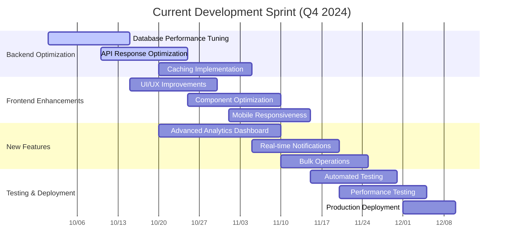

# ICCT Smart Attendance System - Project Gantt Chart

## Mermaid Gantt Chart

```mermaid
gantt
    title ICCT Smart Attendance System Development Timeline
    dateFormat  YYYY-MM-DD
    axisFormat  %m/%d

    section Phase 1: Foundation
    Project Setup & Planning          :done, setup, 2024-01-01, 2024-01-15
    Database Design & Schema         :done, db-design, 2024-01-10, 2024-01-25
    Authentication System            :done, auth, 2024-01-20, 2024-02-05
    Basic UI Framework               :done, ui-framework, 2024-01-25, 2024-02-10

    section Phase 2: Core Features
    Student Management               :done, student-mgmt, 2024-02-01, 2024-02-20
    RFID Integration                 :done, rfid, 2024-02-15, 2024-03-05
    Attendance Tracking             :done, attendance, 2024-02-25, 2024-03-15
    Real-time Dashboard             :done, dashboard, 2024-03-01, 2024-03-20

    section Phase 3: Advanced Features
    Analytics & Reporting           :done, analytics, 2024-03-10, 2024-03-30
    Cloud Storage Integration       :done, cloud-storage, 2024-03-20, 2024-04-10
    Backup System                   :done, backup, 2024-03-25, 2024-04-15
    Performance Optimization        :done, performance, 2024-04-01, 2024-04-20

    section Phase 4: Security & Deployment
    Security Enhancements           :done, security, 2024-04-10, 2024-04-25
    Production Deployment           :done, deployment, 2024-04-20, 2024-05-05
    Testing & Quality Assurance     :done, testing, 2024-04-25, 2024-05-10
    Documentation                   :done, docs, 2024-05-01, 2024-05-15

    section Phase 5: Future Enhancements
    Mobile App Development          :active, mobile, 2024-05-15, 2024-06-30
    Advanced Analytics             :future, adv-analytics, 2024-06-01, 2024-06-30
    AI-Powered Insights            :future, ai-insights, 2024-06-15, 2024-07-30
    Integration APIs                :future, apis, 2024-07-01, 2024-07-30
```

## Alternative Gantt Chart - Current Sprint Focus



## Gantt Chart Features

### Key Features of Mermaid Gantt Charts:

1. **Task Dependencies**: You can define dependencies between tasks
2. **Milestones**: Mark important project milestones
3. **Progress Tracking**: Show completion status with different colors
4. **Date Formatting**: Flexible date formats and axis formatting
5. **Sections**: Organize tasks into logical groups
6. **Status Indicators**: 
   - `done` - Completed tasks
   - `active` - Currently in progress
   - `future` - Planned for future
   - `crit` - Critical path tasks

### Advanced Gantt Chart Example:

```mermaid
gantt
    title Advanced Project Timeline with Dependencies
    dateFormat  YYYY-MM-DD
    axisFormat  %m/%d

    section Critical Path
    Project Initiation              :crit, init, 2024-01-01, 2024-01-05
    Requirements Analysis           :crit, req, after init, 2024-01-10
    System Design                  :crit, design, after req, 2024-01-20
    Database Setup                 :crit, db-setup, after design, 2024-01-25

    section Development
    Backend Development            :backend, after db-setup, 2024-02-15
    Frontend Development           :frontend, after db-setup, 2024-02-15
    Integration Testing            :integration, after backend, after frontend, 2024-03-15

    section Deployment
    User Acceptance Testing        :uat, after integration, 2024-03-20
    Production Deployment         :deploy, after uat, 2024-04-01
    Go-Live Support               :support, after deploy, 2024-04-15
```

## How to Use These Charts

1. **Copy the Mermaid code** from any of the examples above
2. **Paste it into** any Mermaid-compatible editor or viewer
3. **Customize dates and tasks** according to your specific project needs
4. **Add dependencies** using `after` keyword
5. **Mark critical tasks** with `crit` status
6. **Update progress** by changing task status

## Integration with Your Project

You can integrate these Gantt charts into your project documentation by:

1. Adding them to your `README.md`
2. Creating a dedicated `PROJECT_TIMELINE.md` file
3. Including them in your project documentation
4. Using them in project management tools that support Mermaid

The charts above are based on your current project structure and can be customized to reflect your actual development timeline and milestones.
